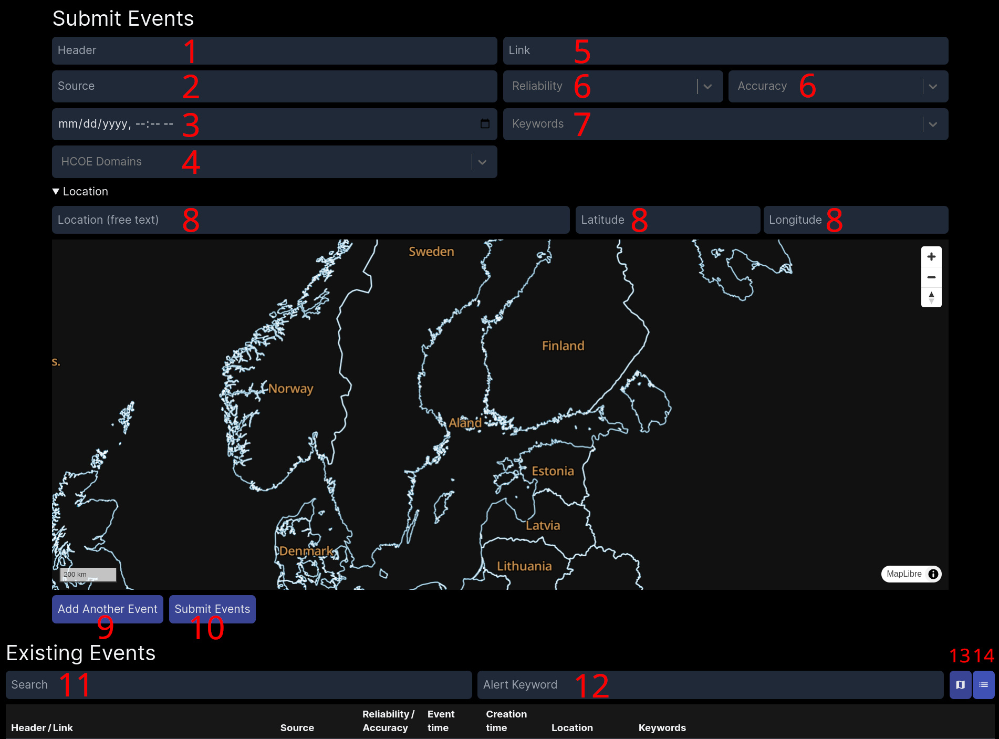

Battlelog is platform to aggregate and enrich data brought from different sources.
All data in Battlelog is handled in "events". Single event can contain following inputs:

1. Header
    * Header of the event.
2. Source
    - Where the data is coming from.
3. Date / time
    - Date and time of the event (this is the time when something happened, not when it was submitted to Battlelog).
4. HCOE Domains
    - Categorization of the event based on Hybrid CoE classification.
5. Link
    - If the event was something that has permanent link (for example Facebook post/ news article, forum post, etc)
6. Admiralty code -> Reliability / Accuracy
    - https://en.wikipedia.org/wiki/Admiralty_code
7. Keywords
    - Tags/keywords to help group and search information.
    - Drop down menu will show and search existing keywords when user is inputting a new keyword.
8. Location
    - Geographic location of the event
    - Includes option to input coordinates and/or free text, if coordinates are unknown.
    - Location can also be set by using the provided map.

After inputting the event details, you can add another event by pressing the "Add Another Event" (9) or press "Submit Event" (10) to save already ready events.
